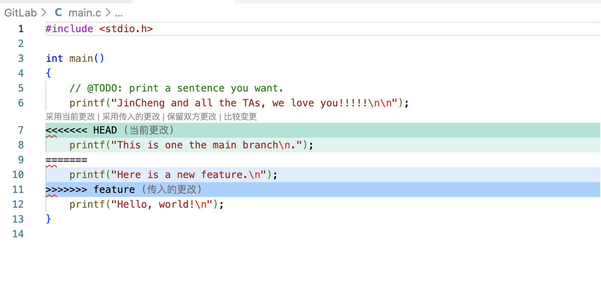

# Lab0 GitLab 实验报告

## 一、回答文档中的问题

1. 我曾经在旦挞团队做AI功能的开发，主要是每个人创建自己的branch然后在上线之前尝试去merge。
2. Git 设计暂存区，能让提交内容更可控、更清晰。如果一次提交所有修改的内容，很不利于审查。因此，通过暂存区 -> 提交，可以实现控制提交的修改内容，也能防止一些敏感信息被提交。
3. git branch 会列出本地的分支，并且用*标记当前的分支。git branch -a (就是--all)会列出本地所有分支和远程跟踪分支

## 二、建立个人仓库并完成一次commit

我的步骤：
1. 根据文档，使用模版仓库建立个人仓库
2. git clone到本地
3. 使用vim完成main.c中的TODO
4. git add . 将修改添加到暂存区
5. git commit -m "xxxx"快捷地进行一次提交

## 三、阅读资料

### [Commit Message 规范](https://www.ruanyifeng.com/blog/2016/01/commit_message_change_log.html)

这篇blog详细讲解了git中commit message的书写规范，以及如何检查并生成Change Log。整体来说，commit message 应当分为Header Body Footer三个部分，其中Header是必需的。

- Header
  - type：说明commit的类别
  - scope：说明commit的影响范围
  - subject：commit目的的简短描述
- Body：对本次commit的详细描述
- Footer
  - 不兼容变动
  - 关闭Issue

### [Gitflow 使用规范](https://notes.vectania.com/article-git-gif-flow)

这篇blog介绍了gitflow的开发流程：Gitflow 用 master、develop、feature、release、hotfix 五类分支管理协作。功能从 develop 开发之后切到 feature，测试之后经 release 修bug 合并到 master，线上 bug 用 hotfix 修复

### [语义化版本](https://semver.org/lang/zh-CN/)

这个文档核心是定义了一套简单明确的版本号规则，以解决软件开发中的“依赖地狱”。
- 版本号格式：主版本号.次版本号.修订号（例如 1.2.3）。
- 递增规则：
  - 主版本号：做了不兼容的 API 修改时递增。
  - 次版本号：做了向下兼容的功能性新增时递增。
  - 修订号：做了向下兼容的问题修正时递增。
  - 扩展信息：可以在后面加上先行版本号（如 -alpha）和版本编译信息（如 +build）。

### 为什么要学习git

它现在已经成为管理代码版本和多人协作的通用工具。git的主要优点在于便于回退、便于多人协作。因为git已经成为大多数公司和项目的标配，所以学习git非常重要。

## 四、练习分支管理

我的步骤：
1. git checkout -b feature 新建并切换到feature分支
2. 修改main.c
3. 提交修改
4. git checkout main。切回到main分支
5. 修改main.c
6. 提交修改

git merge feature会遇到冲突，在vscode中查看：

这里冲突的原因是这两个分支更改的部分重叠了，那么我们保留双方的更改